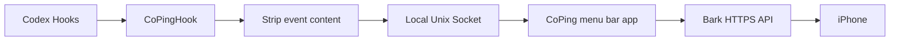
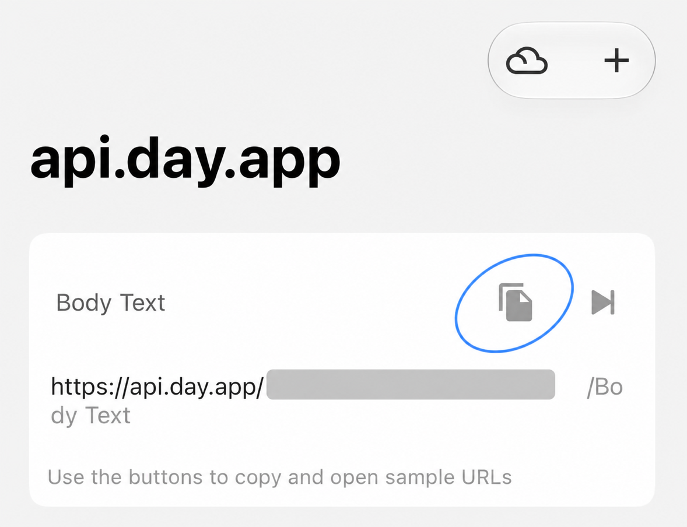

<p align="center">
  
</p>

<p align="center"><a href="README.md">中文</a> · English</p>

A macOS menu bar app. When Codex finishes a task — or gets stuck waiting on you — it pushes a notification to your phone via Bark.

## Why I built this

The idea is simple: hand off a task to Codex, go do something else. In practice, I kept drifting back to my Mac anyway, just to check. Is it done? Is it waiting on a permission? I never knew.

CoPing kills that loop.

## What it does

| Event | What happens |
| --- | --- |
| Task complete | Push immediately |
| Permission request | Wait 5s, push if it's still running |
| Question from Codex | Wait 5s, push if it's still running |

The 5-second wait gives Codex a chance to sort things out on its own — it often does, and you don't need to know about it.

Also in this version: official Bark server or self-hosted HTTPS; mute permission-request notifications individually; push history for the last 100 events; manually check and download updates; launch at login; follows system language, with a manual override for Simplified Chinese or English.

What it doesn't do: approve actions from your phone, reply to Codex, or remote-control anything. Failure notifications aren't in yet either.

## How it works



When Codex fires a hook, a lightweight helper strips out the prompt, replies, commands, and full file paths — keeping only the event type, session ID, and project name — then hands it to CoPing over a local Unix socket.

To show a human-readable task name in the notification (rather than a raw session ID), CoPing does a single read-only lookup against the local Codex state database. That's the only time the database is touched; task state always comes from the hooks themselves.

Notifications go directly from your Mac to your Bark server. No middleman.

## Getting started

**You'll need:** macOS 14+, Codex desktop app, and [Bark](https://github.com/Finb/Bark) on your iPhone.

### Install

Grab the latest `CoPing-macOS-arm64.dmg` from [GitHub Releases](https://github.com/massif-01/CoPing/releases), open it, and drag `CoPing.app` to Applications.

### macOS won't let it open

I haven't joined the Apple Developer Program yet, so this build isn't notarized. macOS may block it with "cannot verify the developer" or "app is damaged."

Make sure the download came from this repo's Releases page, then run:

```bash
xattr -dr com.apple.quarantine /Applications/CoPing.app
open /Applications/CoPing.app
```

This just removes the quarantine flag macOS puts on downloaded files — it doesn't change any system security settings. Never do this for apps from sources you don't trust.

### Set up Bark

Open Bark on your iPhone, copy your Device Key, and paste it into CoPing's settings. The default server URL (`https://api.day.app`) works fine for the official service; swap it out if you're self-hosting. Hit "Save and send test notification," and you're done when your phone buzzes.

On Bark's home screen, find the sample URL card and tap the circled copy button to copy your Device Key:

<p align="center">
  
</p>

### Connect Codex

Go to Settings → Codex and click "Connect Codex." A terminal window will open — type `/hooks`, verify the `CoPingHook` path looks right, trust all CoPing hooks, and close the terminal. Start a new conversation in Codex; once CoPing receives a supported Hook event, the status will switch to Connected.

CoPing merges its entries into `~/.codex/hooks.json` without touching your other hooks, and keeps a timestamped backup. Disconnecting only removes the lines it added.

## Privacy

No account, no server.

Events get scrubbed by the helper before they ever reach the app — prompts, replies, commands, and full paths don't make it through. Notifications may include the task title and project name — that's what makes them useful. Local records store only the event type, project name, timestamp, and delivery result — no conversation content.

The Device Key lives in `~/Library/Application Support/CoPing/config.json` with `0600` permissions and never appears in request URLs or logs. Other processes running as the same macOS user can technically read that file — if that's a concern, running your own Bark server is the cleaner option.

## Roadmap

### v0.1.2 — connection verification, Bark notifications, and manual updates ✓

- [x] Task complete / permission request / question notifications
- [x] Bark official server and self-hosted
- [x] Local push history
- [x] Manually check and download GitHub Release updates
- [x] Launch at login
- [x] Simplified Chinese and English

### v0.2.0 — ntfy

- [ ] ntfy.sh and self-hosted ntfy
- [ ] Topic and access token
- [ ] Notification priority
- [ ] Switch between Bark and ntfy

Not planning to push to both channels simultaneously in this version.

### Down the road

- [ ] More reliable failure notifications
- [ ] Approve or reply to Codex from your phone

## Build from source

```bash
./script/test.sh
./script/build_and_run.sh --verify
```

Swift + SwiftUI. No Electron, no Python, no Node.js.

Release archives must be built from a commit tagged `vMAJOR.MINOR.PATCH` (for example, `v0.1.2`). The packaging scripts inject that tag into the app bundle automatically, so the menu and Version page never need manual version edits.

## License

[Apache License 2.0](LICENSE)
