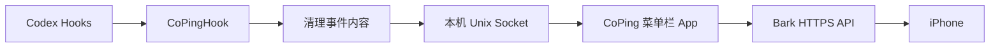

<p align="center">
  
</p>

<p align="center">中文 · <a href="README.en.md">English</a></p>

macOS 菜单栏小工具。Codex 跑完，或者卡在那儿等你拍板时，就把通知推到手机上。

## 为什么做这个

把任务扔给 Codex，自己去忙别的——听起来挺美，实际上过一会儿还是忍不住回来瞅一眼，不然不放心。不知道跑完没，有没有在等我批权限。

来回几次之后，索性做了这个工具。

## 现在能做什么

| 事件 | 处理方式 |
| --- | --- |
| 任务完成 | 立即推送 |
| 权限请求 | 等 5 秒，还没完就推 |
| 普通问题 | 等 5 秒，还没完就推 |

等 5 秒是给 Codex 留点儿反应时间——它有时候自己就把问题解掉了，没必要专程叫你回来。

其他：Bark 官方或自建 HTTPS 服务；单独屏蔽权限请求；查最近 100 条推送记录；手动检查并下载 GitHub Release 更新；开机自启；跟系统语言走，也能手动切简中/英文。

手机上批准操作、回答 Codex、远程控制——这版都没做。执行失败的通知也还没加。

## 原理



Codex 触发 Hook 时，会随之启动一个轻量 Helper，先把提示词、回复、命令、完整路径这些内容剔除，只留事件类型、会话 ID 和项目名，再通过本机 Unix Socket 送入 CoPing。

通知标题得让人看得懂，不能只甩一串 ID，所以 CoPing 会用会话 ID 去本机 Codex 数据库里查任务名。任务状态本身不依赖查库，以 Hooks 事件为准。

通知从 Mac 直发到你的 Bark 服务，没有中间商。

## 上手

**需要：** macOS 14+、Codex 桌面端、iPhone 上装好 [Bark](https://github.com/Finb/Bark)。

### 安装

从 [GitHub Releases](https://github.com/massif-01/CoPing/releases) 下载最新的 `CoPing-macOS-arm64.dmg`，打开后把 `CoPing.app` 拖进“应用程序”文件夹。

### macOS 说打不开

我还没加入 Apple Developer Program，所以这个版本没有公证，macOS 可能会拦下来说"无法验证开发者"或者"已损坏"。

先确认包是从本仓库 Releases 下的，然后终端跑一下：

```bash
xattr -dr com.apple.quarantine /Applications/CoPing.app
open /Applications/CoPing.app
```

这只是摘掉 macOS 给下载文件贴的隔离标签，不影响系统安全设置。来源不明的 App 别这么干。

### 配置 Bark

打开 Bark，复制 Device Key，填进 CoPing 设置里。服务地址默认是 `https://api.day.app`，自建的话换成自己的。点"保存并发送测试通知"，手机收到了就好了。

在 Bark 首页的示例 URL 卡片上，点图中标注的复制按钮，就能复制 Device Key：

<p align="center">
  
</p>

### 接入 Codex

进"设置 → Codex"，点"连接 Codex"，弹出的终端里输 `/hooks`，找到 `CoPingHook` 的路径后点信任，再关掉终端。然后在 Codex 里新建一个对话，等状态变"已连接"就行了。

连接时 CoPing 把配置合并进 `~/.codex/hooks.json`，你已有的 Hooks 不动，同时留一份带时间戳的备份。断开时只删自己写进去的那几条。

## 隐私

没有账号，没有服务器。

事件在进入 CoPing 之前就已经过滤过了——提示词、回复、命令、完整路径都不会进来。通知里可能有任务标题和项目名，方便认出是哪个任务。本地记录只存事件类型、项目名、时间和推送结果，不存对话内容。

Device Key 存在 `~/Library/Application Support/CoPing/config.json`，权限 `0600`，不会出现在请求 URL 或日志里。同一用户下的其他进程能读到这个文件——如果介意，自建 Bark 就行。

## Roadmap

### v0.1.2 — 连接确认、Bark 通知与手动更新 ✓

- [x] 任务完成 / 权限请求 / 普通问题通知
- [x] Bark 官方服务与自建服务
- [x] 本地推送记录
- [x] 手动检查并下载 GitHub Release 更新
- [x] 开机自启
- [x] 简中 / 英文

### v0.2.0 — ntfy

- [ ] ntfy.sh 与自建 ntfy 服务
- [ ] Topic 与访问 Token
- [ ] 通知优先级
- [ ] Bark 与 ntfy 二选一

这版不打算同时往多个通道推。

### 以后

- [ ] 执行失败通知（更可靠的版本）
- [ ] 从手机回答或批准 Codex 请求

## 从源码构建

```bash
./script/test.sh
./script/build_and_run.sh --verify
```

Swift + SwiftUI，不依赖 Electron、Python 或 Node.js。

发布包必须从 `v主版本.次版本.修订版本`（例如 `v0.1.2`）Tag 对应的提交构建。打包脚本会自动把 Tag 写入 App Bundle，菜单和版本页不需要手动修改版本号。

## 协议

[Apache License 2.0](LICENSE)
