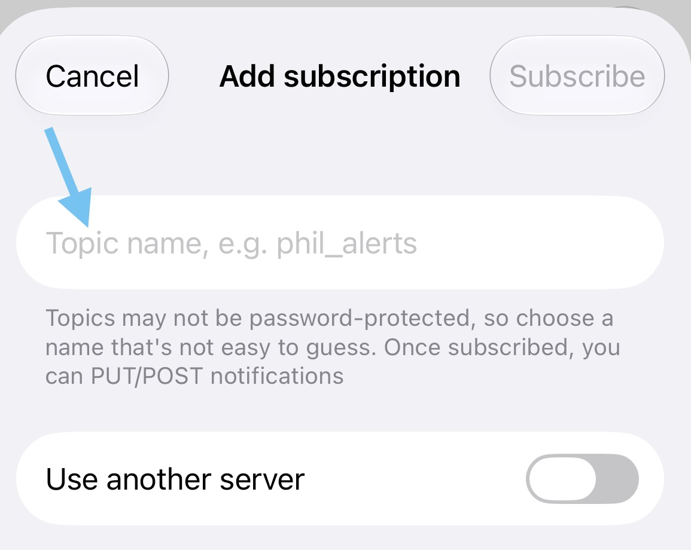

<p align="center">
  
</p>

<p align="center">中文 · <a href="README.en.md">English</a></p>

CoPing 是一个 macOS 菜单栏小工具。让 Codex 在 Mac 上跑着，你去忙别的——任务完成、有问题要回答、或者需要你来审批时，CoPing 会直接推送到手机（支持 Bark 和 ntfy，可以同时开）。

## 会收到哪些通知

- **任务完成**：Codex 做完了，马上告诉你。
- **有问题等你回**：Codex 需要你回复时提醒。
- **等待审批**：可以按自己的习惯选提醒方式。

审批通知可以按需调整，有三档：

| 选项 | 什么时候用 |
| --- | --- |
| **全部提醒** | 每次审批请求都通知我 |
| **仅人工介入** | 只在必须我来操作时通知（推荐） |
| **全部忽略** | 不想收审批通知 |

**推荐"仅人工介入"**：Codex 自己能处理的审批不会打扰你，只有它明确在等你操作时才响。CoPing 偶尔没法判断时，宁可多发一条，避免漏掉重要请求。

> 任务完成和提问通知不受这三档影响。
>
> CoPing 只负责提醒，目前还不能让你直接在手机上审批或回复 Codex。

## 准备工作

- macOS 14 或更高版本
- Codex 桌面 App
- 手机上装好 [Bark](https://github.com/Finb/Bark) 或 [ntfy](https://ntfy.sh/) —— 两个都是可以从 App Store 免费下载的推送通知 App（二选一或都装）

### 安装 CoPing

去 [GitHub Releases](https://github.com/massif-01/CoPing/releases) 下载最新的 `CoPing-macOS-arm64.dmg`，打开后把 `CoPing.app` 拖进"应用程序"文件夹就好。

**macOS 拦截怎么办？** 如果出现"无法验证开发者"或"App 已损坏"的提示，先确认安装包来自本仓库，然后在终端跑这两行：

```bash
xattr -dr com.apple.quarantine /Applications/CoPing.app
open /Applications/CoPing.app
```

> 只对你信任来源的 App 执行这两行命令。

## 配置手机通知

Bark 和 ntfy 都是 App Store 上的免费 App，用来接收推送通知。可以只用其中一个，也可以同时开——某个通道临时出问题，不影响另一个。

### 配置 Bark

1. 打开 iPhone 上的 Bark，复制 Device Key。
2. 在 CoPing 里打开"设置 → Bark"，粘贴进去。
3. 点"保存并发送测试通知"——手机收到就说明好了，启用即可。

在 Bark 首页的示例 URL 卡片上，点图中标注的按钮就能复制 Device Key：

<p align="center">
  
</p>

默认地址对应 Bark 官方服务。如果你自建了 Bark 服务，换成自己的 HTTPS 地址就行。

### 配置 ntfy

ntfy 走官方的 `ntfy.sh`，不用注册账号，也不用自备服务器。

1. 在 CoPing 里打开"设置 → ntfy"，复制那个自动生成的 Topic。
2. 打开手机上的 ntfy，点新增订阅。
3. 把刚才复制的 Topic 粘贴到 **Topic name** 里。

<p align="center">
  
</p>

4. 回到 CoPing，点"保存并发送测试通知"。
5. 手机收到通知后，打开"启用 NTFY"。

Topic 相当于这条通道的通知密码，不要公开分享。如果重新生成了 Topic，手机上的订阅也要跟着换。

## 连接到 Codex

1. 在 CoPing 里打开"设置 → Codex"，点"连接 Codex"。
2. CoPing 会打开一个终端，看到光标后输入 `/hooks` 回车。
3. 找到列表里的 `CoPingHook`，选"信任全部"。
4. 输入 `/quit`，关掉终端就完成了。

不需要另外装命令行版 Codex。连接前已经开着的旧对话可能不会立刻生效，遇到这种情况新建一个 Codex 任务就好。

## 隐私说明

- 不需要账号，CoPing 没有自己的中转服务器。
- 你的提示词、回复内容、命令、完整文件路径不会经过 CoPing 的通知通道。
- 通知里可能带有任务标题和项目名，方便你认出是哪个任务。
- "仅人工介入"的判断完全在本地进行，不保存也不上传对话内容。
- 通知发出去时，Bark 或 ntfy 服务会收到最终显示在手机上的那段文字。
- 本地历史只记录通知类型、项目名、时间和发送结果。

妥善保管你的 Bark Device Key 和 ntfy Topic。

## 其他

- Bark 和 ntfy 独立开关，可以同时推送
- 查看最近 100 条通知记录，包括各通道的发送结果
- 开机自动启动
- 支持简体中文和英文界面
- 应用内直接检查和下载新版本

## 协议

[Apache License 2.0](LICENSE)
